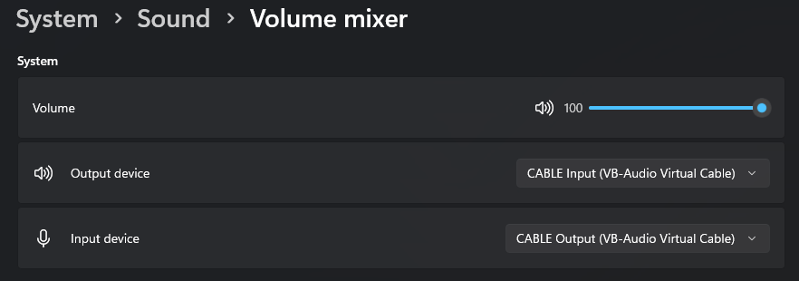
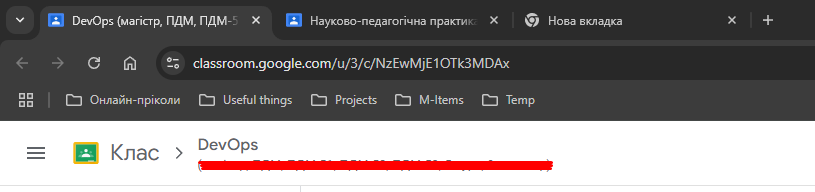

# AutoMeetingManager

AutoMeetingManager is an advanced Python-based tool designed to automate attendance, transcription, and monitoring of Google Classroom meetings. It is particularly useful for those unable to attend meetings manually while ensuring no crucial moments or mentions are missed.

## Features

- **Automated Meeting Attendance:** Automatically joins and exits Google Classroom meetings.
- **Real-time Name Mention Detection:** Sends a Telegram alert whenever your name is mentioned.
- **Audio & Video Recording:** Leverages OBS to record meetings.
- **Audio-to-Text Transcription:** Converts meeting audio into text for easy review.
- **Comprehensive Scheduling:** Handles meetings using precise start and end times.

## Installation Guide

### 1. Install Python Requirements

Ensure you have Python installed on your system (preferably Python 3.x). Then, install the required libraries:

```bash
pip install -r requirements.txt
```

### 2. Install cDNN

Follow one of these methods to install cDNN:

- [Official GitHub instructions for Linux](https://github.com/SYSTRAN/faster-whisper?tab=readme-ov-file#requirements)
- For Windows users:
  - [YouTube Guide by EchoHive](https://www.youtube.com/watch?app=desktop\&v=CfSGIj9QECc\&ab_channel=echohive)
  - [Alternative Guide by Rami Khushaba](https://www.youtube.com/watch?v=Kyc0AgMIBSU\&ab_channel=RamiKhushaba)

### 3. Install VB-CABLE Driver Pack

- Download and install VB-CABLE Driver Pack.

### 4. Hardware Requirements

- **NVIDIA GPU:** 20XX series or above is recommended for optimal performance.

### 5. Environment Variables

Set the following environment variables in a `.env` file:

```
BOT_TOKEN=YOUR_TELEGRAM_BOT_TOKEN
TELEGRAM_USR_ID=YOUR_TELEGRAM_USER_ID
LANGUAGE=en
WHISPER_PROMPT="End incomplete sentences with ellipses.\nExamples:\nComplete: The sky is blue.\nIncomplete: When the sky...\nComplete: She walked home.\nIncomplete: Because he...\n"
SEARCH_WORDS="your, search, words"
```

### 6. Create a Telegram Bot

Follow Telegram’s official [BotFather guide](https://core.telegram.org/bots#botfather) to create a bot and obtain the required `BOT_TOKEN`.

## Usage Instructions

### Prerequisites

1. **Set up your audio device**

   - When using the software package, you must configure **VB-CABLE** as an input and output device in the audio mixer. Exemple:
   
   - You also need to change the settings of your audio devices, see the video instructions: [How set up your audio device for AutoMeetingManager](https://youtu.be/YF9fj6e5oAg)

2. **Open Google Classroom in your browser with the following configuration**

   - Meeting tabs should be arranged from left (first meeting) to right (last meeting).
   - The last tab should be an empty one (no meeting loaded).
   - Example:
     
   


### Running the Program

Run the `start.py` script to initiate the program:

```bash
python start.py
```

The tool will automatically:

- Join meetings.
- Start and stop OBS recording.
- Monitor for your name or keywords.
- Transcribe audio to text and notify you via Telegram.

## Known Issues

- Meetings extending past midnight may require additional logic to handle scheduling.
- Input device indexing for audio transcription may need manual adjustment.

## Contribution

Feel free to contribute by submitting issues, suggesting improvements, or creating pull requests.

---

Thank you for using AutoMeetingManager! If you have any questions or feedback, feel free to reach out.

